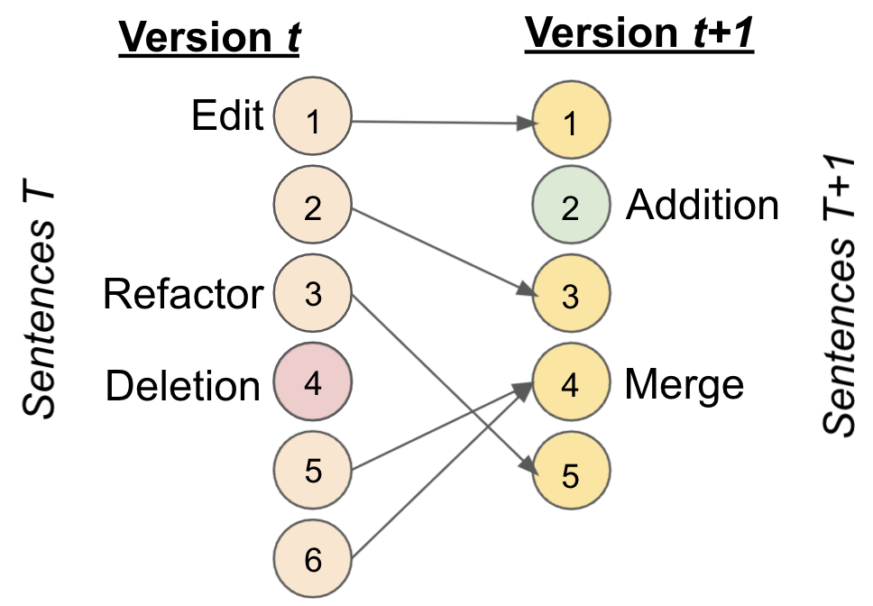

# NewsEdits

Hello and thank you for taking the time to visit NewsEdits! 

This is the repository for the Outstanding Paper in NAACL2022, [NewsEdits: A News Article Revision Dataset and a Novel Document-Level Reasoning Challenge](https://aclanthology.org/2022.naacl-main.10/).

In this repo, we:

1. Provide our preprocessed datasets of NewsEdits. The data can be found at the following [Google Drive](https://drive.google.com/drive/folders/17a5S3liA0C91XbgnMBUQBo-NVb22Z9xf?usp=sharing) url. We provide the following sources: 
    * Associated Press (finished)
    * BBC (finished)
    * Guardian (finished)
    * Independent (finished)
    * New York Times (finished)
    * Washington Post (finished)
    * Reuters (finished)
    * Calgary Herald (matched, no sentence-splitting. Finishing ASAP.)
    * Canadaland (matched, no sentence-splitting. Finishing ASAP.)
    * Canadian Broadcast Corporation (matched, no sentence-splitting. Finishing ASAP.)
    * Dailymail (matched, no sentence-splitting. Finishing ASAP.)
    * Fox (matched, no sentence-splitting. Finishing ASAP.)
    * Globemail (matched, no sentence-splitting. Finishing ASAP.)
    * La Presse (matched, no sentence-splitting. Finishing ASAP.)
    * National Post (matched, no sentence-splitting. Finishing ASAP.)
    * Telegraph (matched, no sentence-splitting. Finishing ASAP.)
    * The Rebel (matched, no sentence-splitting. Finishing ASAP.)
    * Toronto Star (matched, no sentence-splitting. Finishing ASAP.)
    * Toronto Sun (matched, no sentence-splitting. Finishing ASAP.)
    * CNN (not started)
2. Provide demo notebooks to load and visualize the data in the `demo_notebooks/` folder.     
3. Provide Spark scripts to process new datasets in the `spark/` folder.
4. Provide model code (to come).  
    

 


If you've found any of this useful or inspiring, please

```angular2
@inproceedings{spangher-etal-2022-newsedits,
    title = "{N}ews{E}dits: A News Article Revision Dataset and a Novel Document-Level Reasoning Challenge",
    author = "Spangher, Alexander  and
      Ren, Xiang  and
      May, Jonathan  and
      Peng, Nanyun",
    booktitle = "Proceedings of the 2022 Conference of the North American Chapter of the Association for Computational Linguistics: Human Language Technologies",
    month = jul,
    year = "2022",
    address = "Seattle, United States",
    publisher = "Association for Computational Linguistics",
    url = "https://aclanthology.org/2022.naacl-main.10",
    pages = "127--157",
    abstract = "News article revision histories provide clues to narrative and factual evolution in news articles. To facilitate analysis of this evolution, we present the first publicly available dataset of news revision histories, NewsEdits. Our dataset is large-scale and multilingual; it contains 1.2 million articles with 4.6 million versions from over 22 English- and French-language newspaper sources based in three countries, spanning 15 years of coverage (2006-2021).We define article-level edit actions: Addition, Deletion, Edit and Refactor, and develop a high-accuracy extraction algorithm to identify these actions. To underscore the factual nature of many edit actions, we conduct analyses showing that added and deleted sentences are more likely to contain updating events, main content and quotes than unchanged sentences. Finally, to explore whether edit actions are predictable, we introduce three novel tasks aimed at predicting actions performed during version updates. We show that these tasks are possible for expert humans but are challenging for large NLP models. We hope this can spur research in narrative framing and help provide predictive tools for journalists chasing breaking news.",
}
```